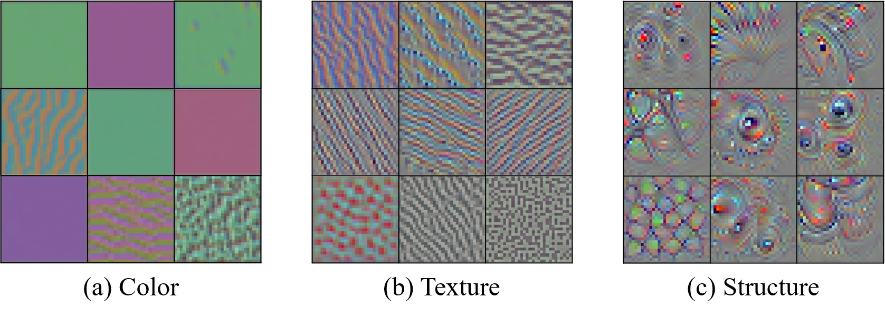
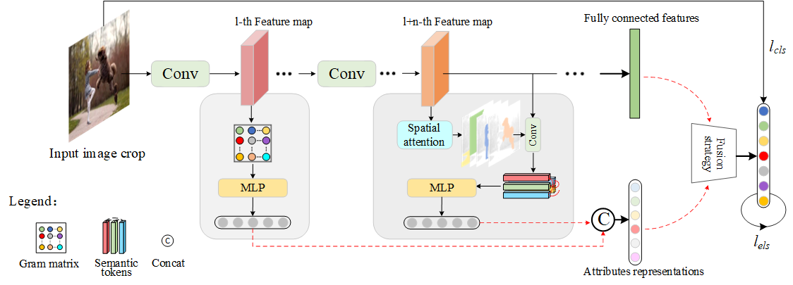

# Affective Image Recognition with Multi-Attribute Knowledge in Deep
Neural Networks

Implementation of "Affective Image Recognition with Multi-Attribute Knowledge in Deep Neural Networks"

## Visualization and Motivation

Visualization of convolution filters. We visualized internal convolution filters in the model after fine-tuning
ResNet, and found that shallow layers contain more visual details such as color and texture (a, b), while deep layers include more structures or semantics (c). Interestingly, textures are composed of colors and lines, leading to advanced features such as object structure. These findings confirm that high-level attributes gradually evolved from low-level features. However, visual details are ignored at high levels and not preserved as the hierarchical structure is processed. Based on these observations, we infer that image emotion recognition requires another representation that may contain missing visual attributes.

## Network Structure

The Network architecture of multi-attribute model (MAM). We expect to extract hybrid attributes from
internal intermediate features, including superficial visual details and deep semantics. Employing ResNet as the backbone network, our MAM extracts visual details and semantic attributes from its internal feature maps. (1) Early in the network, use a gram encoder to learn low-level attributes, and (2) later in the network, use a semantic tokenizer to learn and relate more higher-order semantic concepts.

## Requirements

You may need to install the package via pip:

* **CUDA = 10.2**
* **Python3**
* **MXNet**
* **Pyrotch >= 1.10**
* **d2lzh**

## Results

Classification performance achieved on **FI dataset**.

| Model                |    FI     |
| -------------------- | :-------: |
| Deep metric learning |   68.37   |
| VSF                  |   70.46   |
| MLM                  |   67.49   |
| MSRCA                |   71.13   |
| ViT                  |   56.92   |
| MAP                  |   66.13   |
| BoT                  |   63.76   |
| MAM                  | **71.44** |

## Citation

Hao Zhang, Gaifang Luo, Yingying, Yue, Kangjian, He, Dan Xu. Affective Image Recognition with Multi-Attribute Knowledge in Deep Neural Networks[J]. Preprint submitted to *Multimedia Tools and Applications*, 2023.

